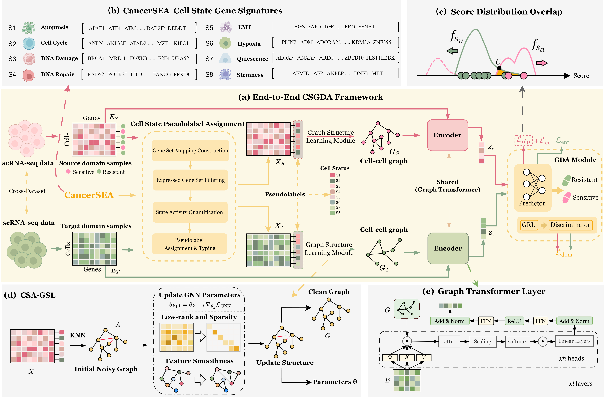

# CSGDA
> **CSGDA: A Cell State-Guided Graph Domain Adaptation Network for Single-Cell Drug Response Prediction**
## Abstract
Intratumoral heterogeneity drives cancer recurrence and metastasis, yet single-cell drug response prediction faces severe "cross-domain" challenges, such as applying in vitro models to in vivo tissues or inferring metastatic resistance from primary tumors. These scenarios trigger catastrophic distribution shifts arising from heterogeneous sequencing platforms, distinct tissue microenvironments, and metastatic evolution—problems rarely addressed by existing methods. We introduce CSGDA, a cell state-guided graph domain adaptation framework designed to predict drug responses across these biological heterogeneities. CSGDA incorporates biological priors to map gene expression into functional cell states, guiding a structure learning module to construct robust cell topology. To conquer distribution shifts, the model employs graph domain adaptation combined with a novel overlap penalty mechanism. Extensive benchmarks on five scRNA-seq datasets demonstrate that CSGDA outperforms state-of-the-art methods, achieving an average gain of ~6% in ACC and AUPR. Beyond prediction accuracy, we employed integrated gradients to effectively pinpoint key genes involved in drug resistance within a challenging cross-metastasis cisplatin dataset. These findings underscore CSGDA’s superior performance in single-cell drug response prediction and its potential in resolving single-cell heterogeneity, paving the way for precision therapeutic strategies. 



## 📂 Dataset
The original and preprocessed datasets can be found at:[Google Drive Dataset Link](https://drive.google.com/drive/folders/1dDnOLZRCkdSpsqL0npdFwwA5GHixgGC-?usp=drive_link)

## 📖 Abstract
* **Hardware**: Intel Xeon 16-core CPU, 128 GB RAM, NVIDIA GeForce RTX 3090 GPU (24 GB VRAM).
* **OS**: Ubuntu 22.04 LTS.
* **Software**: Python 3.10, CUDA 12.1.

## 🛠️ Installation & Requirements

We recommend using **Conda** to manage your environment:

```bash
# Create and activate environment
conda create -n csgda python=3.10 -y
conda activate csgda

# Install Core Dependencies
pip install numpy>=1.24.3 pandas==2.0.3 scikit-learn==1.3.2 scipy==1.10.1 scanpy==1.9.8 anndata==0.9.2

# Install PyTorch with CUDA 12.1 support
pip install torch==2.4.1 torchvision==0.19.1 torchaudio==2.4.1 --index-url [https://download.pytorch.org/whl/cu121](https://download.pytorch.org/whl/cu121)

# Install Graph Computing Libraries
pip install dgl==2.4.0+cu121 -f [https://data.dgl.ai/wheels/cu121/repo.html](https://data.dgl.ai/wheels/cu121/repo.html)
pip install torch-geometric==2.6.1
pip install torch-scatter==2.1.2+pt24cu121 -f [https://data.pyg.org/whl/torch-2.4.0+cu121.html](https://data.pyg.org/whl/torch-2.4.0+cu121.html)
pip install torch-sparse==0.6.18+pt24cu121 -f [https://data.pyg.org/whl/torch-2.4.0+cu121.html](https://data.pyg.org/whl/torch-2.4.0+cu121.html)

# Install Graph Structure Learning (ProGNN) and others
pip install deeprobust==0.2.11 tqdm matplotlib seaborn transformers==4.46.3

# To run the code, first you need to install DeepRobust:
pip install deeprobust
# Or you can clone it and install from source code:
git clone https://github.com/DSE-MSU/DeepRobust.git
cd DeepRobust
python setup.py install
```


## 🧬 Biological Prior: CancerSEA-Guided Learning
The **CSA-GSL (Cell State-Aware Graph Structure Learning)** module in CSGDA is a key innovation designed to bridge the gap between transcriptomic noise and biological function:
* Pre-training with CancerSEA: We leverage the **CancerSEA** database (containing 8 functional cell states such as *Apoptosis, Cell Cycle, EMT, Hypoxia,* etc.) to pre-train a cell-state encoder. 
* Functional Mapping: By mapping high-dimensional gene expression data into these 8-dimensional functional vectors, CSGDA can effectively filter out sequencing noise and focus on the metabolic and signaling states that drive drug resistance.
* Topology Refinement: These pre-trained cell states serve as biological guidance for the ProGNN-based structure learning, ensuring that the constructed cell-to-cell graphs reflect true biological similarities rather than just technical batch effects.
* **Pre-trained Data Path**: Inside the folder `scTosc/PreprocessingData/`, you will find `.npz` files (e.g., `clean_graph_source_PLX4720.npz`).
* **Note**: We have already completed the CSA-GSL pre-training. You can directly use these `.npz` files to skip the time-consuming graph refinement stage.[Google Drive Dataset Link](https://drive.google.com/drive/folders/1dDnOLZRCkdSpsqL0npdFwwA5GHixgGC-?usp=drive_link)
  
```bash
python generate_clean_graphs.py --drug PLX4720 --cuda 0 --k_source 15 --k_target 15 --epochs 300
```
The CSA-GSL module utilizes the ProGNN framework guided by CancerSEA functional priors. For the cross-domain task, we established the following hyperparameter configuration to refine the cell-to-cell topological graphs:

| Parameter (Argument) | Description | Value |
| :--- | :--- | :--- |
| Learning Rate (lr) | Initial learning rate for the GCN backbone | 1e-2 |
| Learning Rate Adj (lr_adj) | Learning rate for the adjacency matrix optimization | 1e-2 |
| Weight Decay | L2 regularization applied to the GCN optimizer | 5e-3 |
| Epochs | Total number of ProGNN training iterations | 300 |
| Hidden Dim (hidden) | Dimension of the hidden layer in GCN | 16 |
| Dropout Rate (dropout) | Dropout rate used in GCN layers | 0.6 |
| Alpha ($\alpha$) | Weight for L1 sparsity regularization on Adjacency | 5e-4 |
| Beta ($\beta$) | Weight for Nuclear Norm (low-rank) regularization | 1.0 |
| Gamma ($\gamma$) | Weight for the Laplacian smoothness regularization | 1.0 |
| Lambda ($\lambda$) | Weight for the GCN classification loss guidance | 0.1 |
| Inner Steps | Iterations for adjacency matrix optimization per epoch | 2 |
| Outer Steps | Iterations for GCN model optimization per epoch | 1 |
| $k$-source ($k_s$) | Initial neighbors for Source Graph (Bulk Data) | 15 |
| $k$-target ($k_t$) | Initial neighbors for Target Graph (scRNA Data) | 15 |
| Validation Ratio | Ratio of data used for internal performance monitoring | 0.2 |
| Symmetric	| Whether to enforce a symmetric adjacency matrix | False | 

#### 🔍 Parameter Justification
* Graph Sparsity ($\alpha$): Set to `5e-4` to remove spurious edges caused by technical noise in scRNA-seq while preserving key functional connections.
* Neighborhood Consistency ($k_s/k_t$): A higher $k_s$ (15) is used for Bulk data to capture broader population traits, while a more focused $k_t$ (10) is applied to single-cell data to accommodate higher granularity.
* Cell-State Guidance: The inclusion of **CancerSEA** pre-trained functional states allows the model to utilize the $\lambda$ weight more effectively, aligning the learned topology with biological functional clusters (e.g., EMT, Hypoxia).

## Tainning Model --CSGDA
### Run Code
To train DAGFormer on your dataset, you can run the following command:

```bash
python main.py --cuda 0 -d PLX4720
```

### ⚙️ CSGDA Model Training Hyperparameters
The following table summarizes the hyperparameter configuration for the CSGDA training process. The model incorporates a dynamic weighting strategy to balance supervised classification, domain adaptation, and target domain entropy minimization.
| Parameter (Argument) | Description | Value |
| :--- | :--- | :--- |
| Learning Rate (lr) | Initial learning rate for the Adam optimizer | 1e-2 |
| Weight Decay | L2 regularization applied to all model parameters | 5e-4 |
| Epochs (n_epoch) | Total number of training iterations | 200 |
| Hidden Dim (hidden) | Hidden units in the Graph Transformer (GT) encoder | 1024 |
| Graph Feature (gfeat) | Dimension of the shared latent embedding | 256 |
| Dropout Rate (dropout) | Dropout probability for latent layers and GRL | 0.5 |
| Lambda Overlap | Weight for the Overlap Penalty Loss on source domain | 1.0 |
| Lambda CE | Weight for the Cross-Entropy classification loss | 1.0 |
| Lambda Domain (lambda_d) | Base weight for Domain Adaptation Loss | 0.6 (max) |
| Lambda Entropy | Weight for Target Domain Entropy Loss | 0.1 (max) |
| GRL Rate | Gradient Reversal Layer scaling factor | Schedule: min((epoch+1)/n_epoch, 0.05) |
| Classes | Number of categories (Sensitive vs. Resistant) | 2 |
